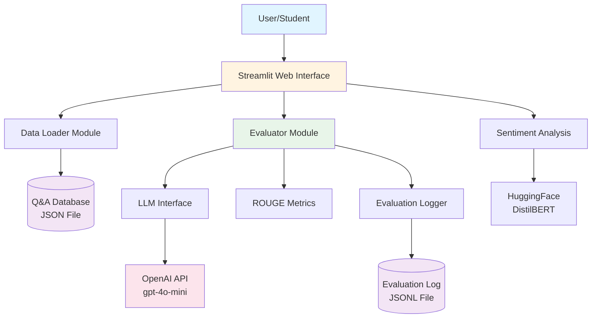
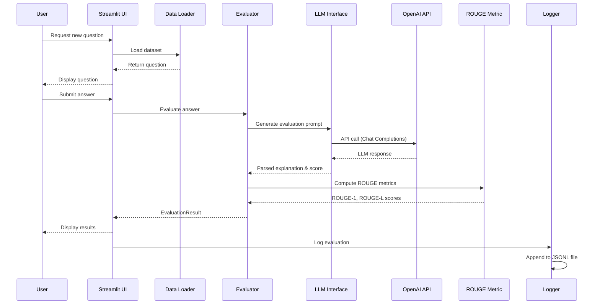
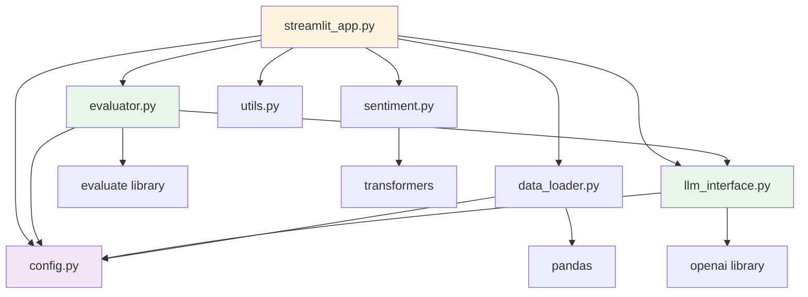

# System Architecture Documentation

> **📊 Viewing Diagrams**: This document contains Mermaid diagrams. To view them:
> - **Easiest**: View on GitHub/GitLab (auto-renders)
> - **VS Code**: Install "Markdown Preview Mermaid Support" extension
> - **Online**: Copy diagram code to https://mermaid.live/
> - **See**: `README.md` section "Viewing Diagrams" for detailed instructions

## Overview

The LLM Evaluator Chatbot is a web-based application that evaluates student answers to machine learning theory questions using a combination of LLM-based semantic evaluation and automatic lexical metrics (ROUGE).

## High-Level Architecture



## Component Architecture

### 1. Presentation Layer

**Streamlit Web Application** (`app/streamlit_app.py`)
- **Purpose**: User-facing web interface
- **Responsibilities**:
  - Render UI components (questions, answer input, results)
  - Manage user session state
  - Handle user interactions (question selection, evaluation requests, feedback)
  - Display evaluation results with visualizations
- **Key Features**:
  - Responsive layout with sidebar configuration
  - Real-time evaluation feedback
  - Multi-language support
  - Feedback collection with sentiment analysis

### 2. Business Logic Layer

#### 2.1 Evaluator Module (`src/evaluator.py`)
- **Purpose**: Core evaluation engine
- **Responsibilities**:
  - Build evaluation prompts
  - Orchestrate LLM and ROUGE evaluation
  - Parse LLM responses
  - Combine multiple evaluation metrics
- **Key Functions**:
  - `build_evaluation_prompt()`: Constructs structured prompts
  - `evaluate_answer()`: Main evaluation orchestration
  - `parse_score_from_text()`: Extracts scores from LLM responses

#### 2.2 LLM Interface (`src/llm_interface.py`)
- **Purpose**: Abstraction layer for LLM interactions
- **Responsibilities**:
  - Manage OpenAI API client
  - Handle API calls and error handling
  - Define system prompts
  - Generate completions with configurable parameters
- **Key Functions**:
  - `generate_completion()`: Main LLM interaction
  - `generate_novice_answer()`: Simulated student answers

#### 2.3 Data Loader (`src/data_loader.py`)
- **Purpose**: Dataset management
- **Responsibilities**:
  - Load Q&A database from JSON
  - Validate data structure
  - Provide random question selection
  - Handle data access by ID
- **Key Functions**:
  - `load_qa_dataset()`: Load and validate dataset
  - `get_random_question()`: Random question selection

#### 2.4 Sentiment Analysis (`src/sentiment.py`)
- **Purpose**: Analyze user feedback sentiment
- **Responsibilities**:
  - Load and cache sentiment model
  - Analyze feedback text
  - Return sentiment labels and scores
- **Model**: DistilBERT-based sentiment classifier

### 3. Data Layer

#### 3.1 Q&A Database
- **Format**: JSON array of question-answer pairs
- **Location**: `data/Q&A_db_practice.json`
- **Structure**:
  ```json
  [
    {
      "question": "What is an activation function?",
      "answer": "An activation function introduces non-linearity..."
    }
  ]
  ```

#### 3.2 Evaluation Log
- **Format**: JSONL (JSON Lines)
- **Location**: `data/evaluations_log.jsonl`
- **Purpose**: Append-only log of all evaluations
- **Contents**: Timestamps, questions, answers, scores, metrics, feedback

### 4. External Services

#### 4.1 OpenAI API
- **Service**: Chat Completions API
- **Model**: gpt-4o-mini (configurable)
- **Usage**: Answer evaluation and explanation generation
- **Configuration**: API key via environment variable

#### 4.2 HuggingFace
- **Service**: Transformers library
- **Model**: distilbert-base-uncased-finetuned-sst-2-english
- **Usage**: Sentiment analysis of user feedback
- **Deployment**: Local model loading (no API calls)

## Data Flow Architecture



## Module Dependencies



## Technology Stack

### Core Technologies
- **Python 3.8+**: Primary programming language
- **Streamlit**: Web framework for UI
- **OpenAI API**: LLM service provider
- **HuggingFace Transformers**: Sentiment analysis model

### Key Libraries
- **pandas**: Data manipulation and dataset handling
- **evaluate**: ROUGE metric computation
- **openai**: OpenAI API client
- **transformers**: HuggingFace model loading
- **python-dotenv**: Environment variable management

### Configuration Management
- **Environment Variables**: API keys, model settings
- **Config Module**: Centralized configuration with defaults
- **Path Management**: Pathlib for cross-platform compatibility

## System Design Principles

### 1. Modularity
- Clear separation of concerns
- Each module has a single responsibility
- Loose coupling between components

### 2. Extensibility
- Configurable model selection
- Pluggable evaluation strategies
- Easy to add new metrics or features

### 3. Maintainability
- Comprehensive docstrings
- Type hints throughout
- Clear error handling
- Logging for debugging

### 4. Scalability Considerations
- Stateless evaluation (no session dependencies)
- Efficient caching (ROUGE metric, sentiment model)
- Lazy loading of heavy resources
- Configurable token limits for cost control

## Security Architecture

### API Key Management
- **Storage**: Environment variables or `.env` files
- **Never committed**: `.gitignore` excludes `.env`
- **Validation**: Runtime checks for API key presence

### Data Privacy
- **Local Processing**: Sentiment analysis runs locally
- **External API**: Only evaluation prompts sent to OpenAI
- **Logging**: User data stored locally in JSONL format
- **Recommendation**: Scrub PII before production use

## Performance Characteristics

### Latency
- **LLM Evaluation**: ~1-2 seconds (network + API processing)
- **ROUGE Computation**: <100ms (local computation)
- **Sentiment Analysis**: <200ms (cached model)
- **Total Evaluation**: ~2-3 seconds typical

### Resource Usage
- **Memory**: ~500MB-1GB (includes cached models)
- **CPU**: Low (mostly I/O bound)
- **Network**: API calls to OpenAI
- **Storage**: Minimal (logs grow over time)

### Cost Considerations
- **OpenAI API**: Pay-per-token pricing
- **Model**: gpt-4o-mini (cost-efficient)
- **Token Limits**: Configurable max tokens (default: 512)
- **Optimization**: Lower temperature (0.2) for consistency

## Error Handling Strategy

### Levels of Error Handling
1. **User-Facing Errors**: Displayed in Streamlit UI
2. **Application Errors**: Logged with context
3. **API Errors**: Graceful degradation with user feedback
4. **Data Errors**: Validation with clear error messages

### Resilience Features
- **Default Values**: Fallback scores if parsing fails
- **Graceful Degradation**: Continue operation if optional features fail
- **Validation**: Input validation at multiple layers
- **Logging**: Comprehensive error logging for debugging

## Future Architecture Considerations

### Potential Enhancements
1. **Database Integration**: Replace JSON files with proper database
2. **Caching Layer**: Redis for frequently accessed questions
3. **Queue System**: Async processing for batch evaluations
4. **API Service**: REST API for programmatic access
5. **Multi-model Support**: Support for other LLM providers
6. **Structured Output**: JSON/structured responses from LLM
7. **Monitoring**: Application performance monitoring
8. **Authentication**: User authentication and authorization

### Scalability Paths
- **Horizontal Scaling**: Stateless design supports multiple instances
- **Load Balancing**: Can distribute across multiple Streamlit instances
- **Microservices**: Could split into separate services (evaluator, UI, logging)
- **Cloud Deployment**: Designed for cloud deployment (Heroku, AWS, GCP)

