# Process Flow Diagrams

> **📊 Viewing Diagrams**: This document contains Mermaid flowcharts. To view them:
> - **Easiest**: View on GitHub/GitLab (auto-renders)
> - **VS Code**: Install "Markdown Preview Mermaid Support" extension
> - **Online**: Copy diagram code to https://mermaid.live/
> - **See**: `README.md` section "Viewing Diagrams" for detailed instructions

This document provides detailed process flow diagrams for all major workflows in the LLM Evaluator Chatbot system.

## Table of Contents
1. [User Interaction Flow](#user-interaction-flow)
2. [Evaluation Process Flow](#evaluation-process-flow)
3. [Data Processing Pipeline](#data-processing-pipeline)
4. [Feedback Collection Flow](#feedback-collection-flow)
5. [System Initialization Flow](#system-initialization-flow)
6. [Error Handling Flow](#error-handling-flow)

---

## User Interaction Flow

### Complete User Journey

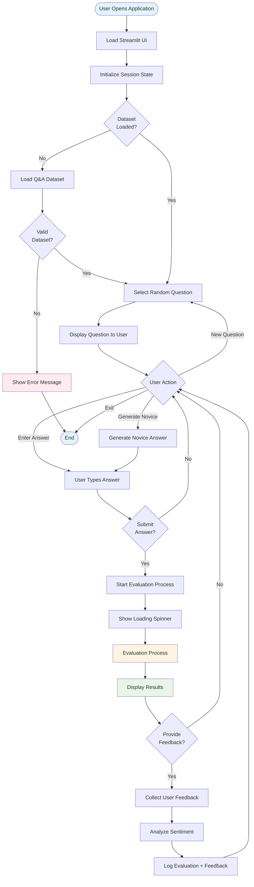

### Question Selection Flow

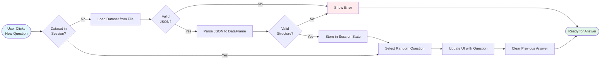

---

## Evaluation Process Flow

### Complete Evaluation Pipeline

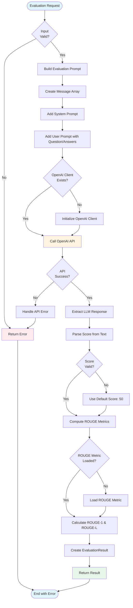

### Prompt Building Process

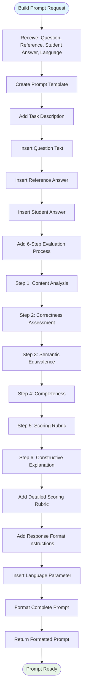

### Score Parsing Process

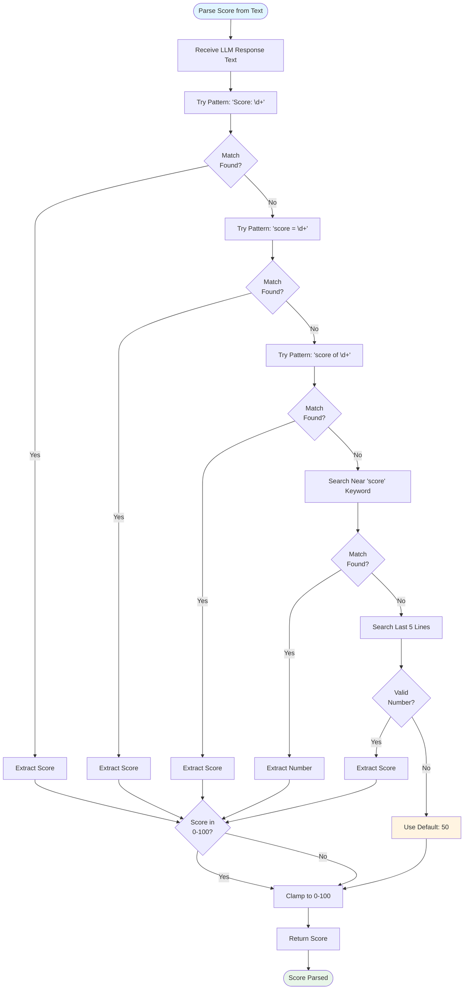

---

## Data Processing Pipeline

### Dataset Loading Flow

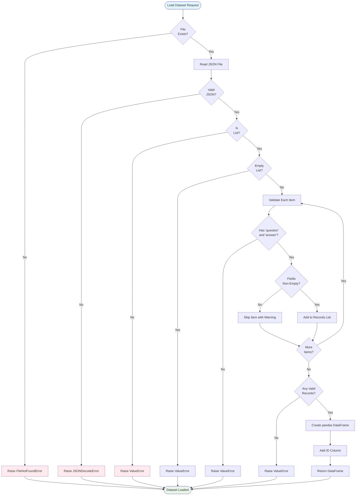

### Logging Flow

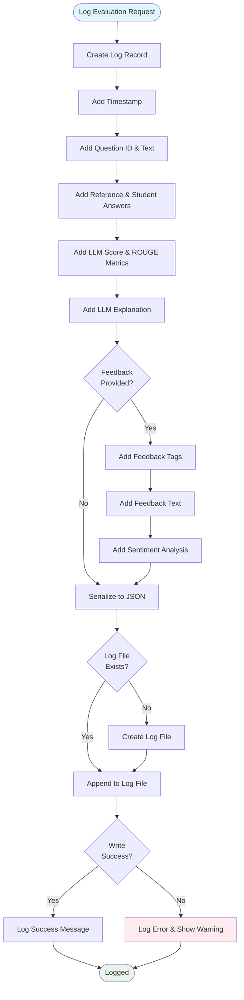

---

## Feedback Collection Flow

### Complete Feedback Process

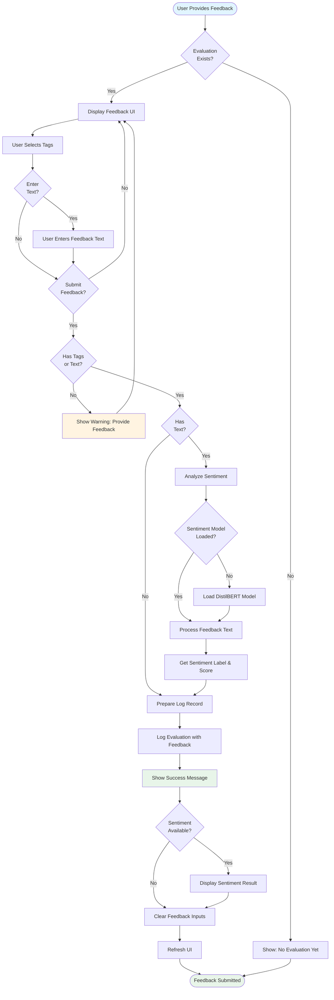

---

## System Initialization Flow

### Application Startup

```mermaid
flowchart TD
    Start([Application Start]) --> ImportModules[Import All Modules]
    ImportModules --> LoadConfig[Load Configuration Module]
    
    LoadConfig --> CheckEnvVars[Check Environment Variables]
    CheckEnvVars --> CheckAPIKey{API Key<br/>Set?}
    
    CheckAPIKey -->|No| WarnAPIKey[Log Warning: API Key Missing]
    CheckAPIKey -->|Yes| EnsureDirs[Ensure Directories Exist]
    WarnAPIKey --> EnsureDirs
    
    EnsureDirs --> CheckDataDir{Data Directory<br/>Exists?}
    CheckDataDir -->|No| CreateDataDir[Create Data Directory]
    CheckDataDir -->|Yes| CheckLogDir{Log Directory<br/>Exists?}
    CreateDataDir --> CheckLogDir
    
    CheckLogDir -->|No| CreateLogDir[Create Log Directory]
    CheckLogDir -->|Yes| InitStreamlit[Initialize Streamlit]
    CreateLogDir --> InitStreamlit
    
    InitStreamlit --> SetPageConfig[Set Page Configuration]
    SetPageConfig --> InitSessionState[Initialize Session State]
    
    InitSessionState --> InitQuestion[Initialize: current_question = None]
    InitQuestion --> InitEvaluation[Initialize: last_evaluation = None]
    InitEvaluation --> InitDataset[Initialize: dataset = None]
    InitDataset --> InitShowRef[Initialize: show_reference = False]
    InitShowRef --> InitLanguage[Initialize: language = 'English']
    
    InitLanguage --> RenderUI[Render UI Components]
    RenderUI --> End([Application Ready])
    
    style Start fill:#e1f5ff
    style End fill:#e8f5e9
    style WarnAPIKey fill:#fff4e1
```

### Module Initialization

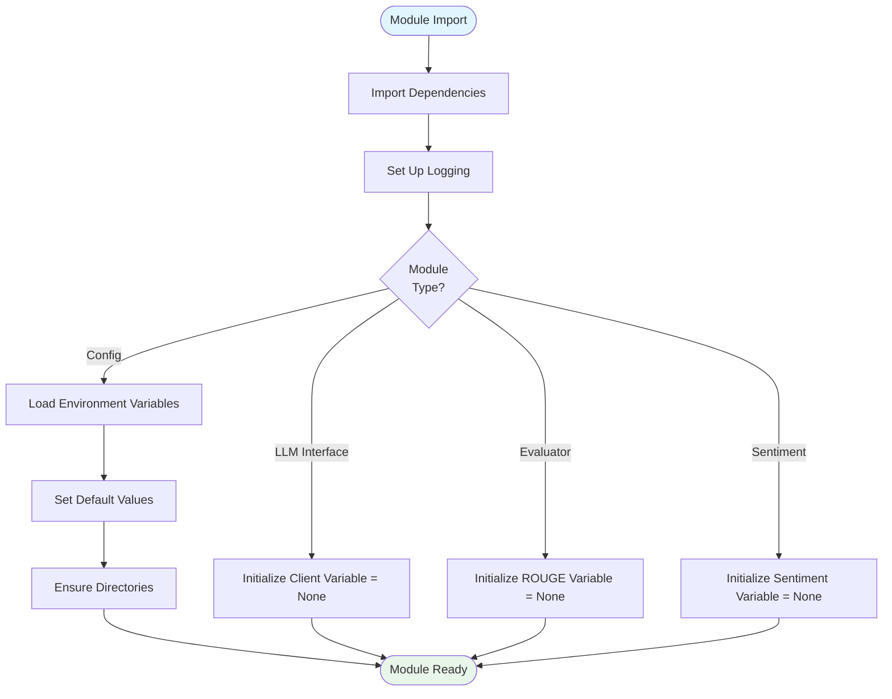

---

## Error Handling Flow

### API Error Handling

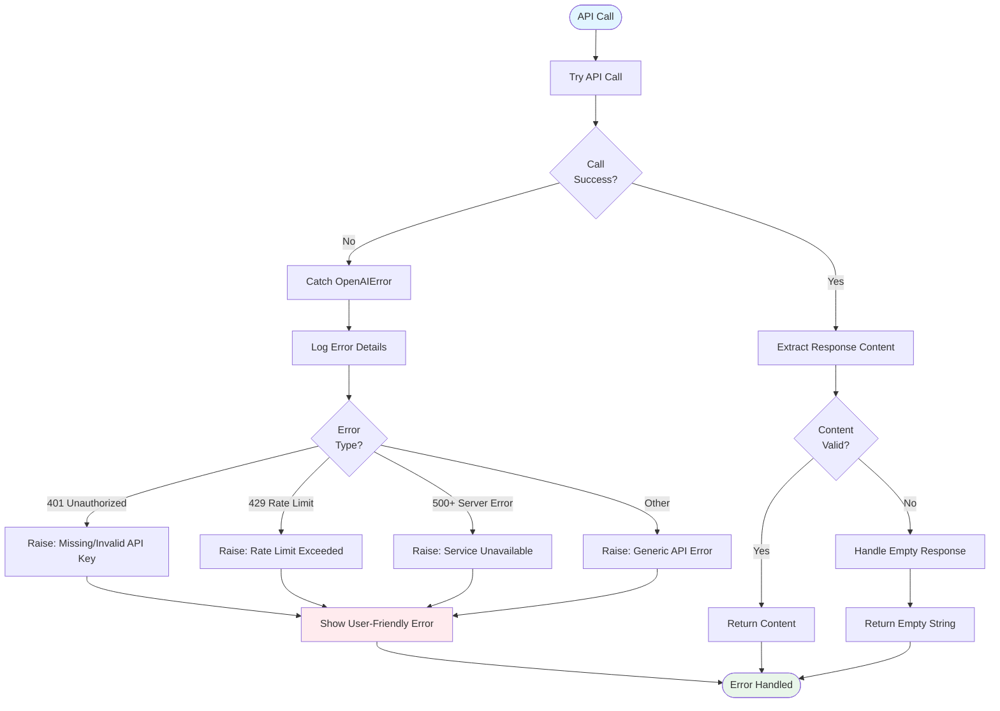

### Data Validation Flow

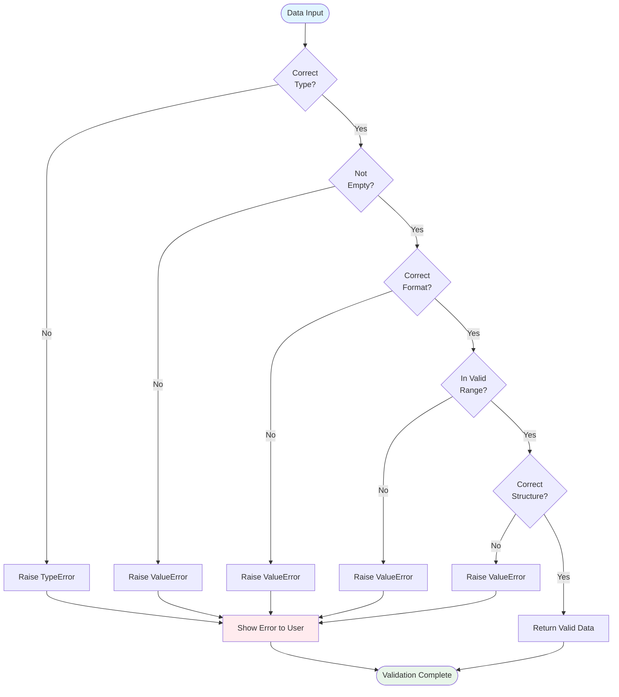

---

## Summary

These process flows document the complete workflows for:

1. **User Interactions**: Complete user journey from application start to feedback submission
2. **Evaluation Process**: Detailed evaluation pipeline from input to result
3. **Data Processing**: Dataset loading and logging procedures
4. **Feedback Collection**: User feedback gathering and sentiment analysis
5. **System Initialization**: Application and module startup procedures
6. **Error Handling**: Comprehensive error handling and recovery

All flows are designed to be:
- **Clear**: Easy to understand and follow
- **Complete**: Cover all major paths and edge cases
- **Maintainable**: Easy to update as system evolves
- **Documented**: Support development and debugging

These diagrams can be used for:
- Understanding system behavior
- Onboarding new developers
- Debugging issues
- Planning enhancements
- Documentation for stakeholders

